# Relatório Técnico — Tech Challenge FIAP Fase 1
## Sistema de Classificação de Risco Gestacional

**Aluno:** Igor Natanael  
**Curso:** Pós-graduação IA para Devs — FIAP  
**Dataset:** Maternal Health Risk Data Set (UCI, ID 863)  
**Repositório:** *(inserir link do GitHub)*

---

## 1. Problema e Justificativa

Uma rede de hospitais especializada em saúde da mulher necessita de um sistema inteligente de suporte ao diagnóstico para triagem precoce de risco gestacional. O problema foi modelado como **classificação multiclasse supervisionada**: dadas medições clínicas básicas de uma paciente grávida, o modelo prediz o nível de risco gestacional — baixo, médio ou alto.

A escolha do dataset *Maternal Health Risk* foi motivada por três fatores: alinhamento direto com o tema de saúde materna, variáveis clinicamente significativas (sinais vitais coletáveis em qualquer posto de saúde) e disponibilidade pública documentada na UCI.

O modelo proposto atua exclusivamente como **suporte à decisão clínica**. O profissional de saúde tem sempre a palavra final — o sistema visa reduzir o tempo de triagem e chamar atenção para casos de alto risco, não substituir o julgamento médico.

---

## 2. Dataset

### 2.1 Origem e contexto

O **Maternal Health Risk Data Set** (UCI ML Repository, ID 863) foi criado por Marzia Ahmed e Mohammod Kashem e publicado originalmente no artigo *"IoT Based Risk Level Prediction Model For Maternal Health Care In The Context Of Bangladesh"* (IEEE ICCIT, 2020). Os dados foram coletados entre 2018 e 2020 em hospitais, clínicas comunitárias e unidades de saúde materna em áreas rurais de Bangladesh, utilizando um sistema de monitoramento baseado em dispositivos IoT.

O contexto de coleta é central para interpretar o dataset: Bangladesh é um país de renda média-baixa com disparidades significativas no acesso à saúde especializada em regiões rurais. O sistema proposto pelos autores visa justamente suprir essa lacuna — triagem precoce de risco gestacional com sinais vitais coletáveis por qualquer agente de saúde, sem necessidade de exames laboratoriais complexos.

### 2.2 Características do dataset

O dataset original contém **1.014 registros × 7 colunas**:

| Atributo | Tipo | Descrição | Unidade |
|---|---|---|---|
| `Age` | Inteiro | Idade da paciente | anos |
| `SystolicBP` | Inteiro | Pressão arterial sistólica | mmHg |
| `DiastolicBP` | Inteiro | Pressão arterial diastólica | mmHg |
| `BS` | Contínuo | Glicemia (*Blood Sugar*) | mmol/L |
| `BodyTemp` | Contínuo | Temperatura corporal | °F |
| `HeartRate` | Inteiro | Frequência cardíaca | bpm |
| `RiskLevel` | Categórico | **Alvo** — nível de risco gestacional | low / mid / high risk |

Não há valores ausentes. O alvo é balanceado de forma moderada: aproximadamente 40% `low risk`, 33% `mid risk` e 27% `high risk`.

### 2.3 Uso acadêmico e relevância

O dataset é amplamente adotado pela comunidade científica. Artigos publicados em veículos de alto impacto o utilizam como benchmark para métodos de classificação em saúde materna:

- **IEEE** (conferência de origem) — Ahmed & Kashem, 2020
- **PLOS ONE** — ensemble learning com feature engineering para predição de risco gestacional
- **Nature Scientific Reports** — framework de ensemble machine learning para risco na gravidez
- **Frontiers in Artificial Intelligence** — modelo híbrido ANN + Random Forest
- **PMC / BioMed Central** — análise com PCA e TreeNet

Nenhum desses trabalhos documenta as medições repetidas como problema de qualidade, o que sustenta a abordagem conservadora adotada neste projeto (manter até 3 ocorrências por grupo, detalhada na Seção 3).

### 2.4 Justificativa de escolha

A seleção deste dataset foi motivada por quatro fatores: (1) **alinhamento direto com o problema proposto** — classificação de risco gestacional é exatamente o contexto do Tech Challenge; (2) **variáveis clinicamente significativas** — os 6 sinais vitais são coletáveis em qualquer posto de saúde, tornando o sistema viável em cenários de recursos limitados; (3) **disponibilidade pública documentada** na UCI com referência à publicação original; e (4) **uso consolidado na academia**, o que permite comparação com benchmarks existentes e valida a relevância do problema.

---

## 3. Análise Exploratória de Dados (EDA)

### 2.1 Visão geral

O dataset original contém 1.014 registros × 7 colunas (6 features numéricas + alvo categórico). Não há valores ausentes. Todos os atributos são contínuos ou discretos — sem variáveis categóricas nas features.

### 2.2 Qualidade dos dados

**Outliers fisiológicos:** 2 registros com `HeartRate < 30 bpm` — valor impossível em humano vivo, provável erro de digitação. Removidos.

**Outlier de idade:** o dataset apresenta um pico concentrado em exatamente 60 anos que não aparece documentado como clinicamente válido em nenhum artigo que utiliza esta base. Gestações acima dos 54 anos são fisiologicamente muito improváveis sem reprodução assistida avançada — contexto não documentado no dataset. O corte em **Age ≤ 54** corresponde ao p75 da menopausa natural em estudos populacionais (mediana: 51,25 anos; p75 = 54 anos — *Maturitas*, 1995). 84 registros removidos.

**Medições repetidas:** o dataset possui 562 linhas (55,4%) com ao menos uma cópia idêntica em todos os campos. Este dataset é amplamente referenciado em artigos publicados na IEEE, PLOS ONE, Nature Scientific Reports e PMC — nenhum deles cita as repetições como problema de qualidade. Optamos por uma abordagem conservadora: **mantemos até 3 ocorrências por grupo idêntico**, removendo apenas grupos com 4 ou mais repetições, que têm maior probabilidade de serem artefatos de logging do sistema IoT de coleta. 140 linhas removidas. Dataset final após todas as etapas de limpeza: **~790 registros**.

### 3.3 Balanceamento do alvo

Após limpeza (790 registros, split 80/20 → 632 treino / 158 teste):

| Classe | Treino | % | Teste | % |
|---|---|---|---|---|
| low risk | 277 | 43,8% | 69 | 43,7% |
| mid risk | 198 | 31,3% | 50 | 31,6% |
| high risk | 157 | 24,8% | 39 | 24,7% |

Desbalanceamento moderado — não justifica SMOTE, mas justifica `class_weight='balanced'` nos modelos.

### 2.4 Correlações com o alvo

Codificando o alvo como ordinal (low=0, mid=1, high=2):

| Feature | Pearson r |
|---|---|
| BS (glicemia) | 0,57 |
| SystolicBP | 0,40 |
| DiastolicBP | 0,35 |
| Age | 0,27 |
| HeartRate | 0,19 |
| BodyTemp | 0,16 |

Glicemia é a feature individualmente mais preditiva. Nenhuma feature tem correlação muito alta, indicando que o problema exige captura de interações — favorece modelos não-lineares.

### 2.5 Multicolinearidade

`SystolicBP` e `DiastolicBP` apresentam correlação de Pearson r = 0,79 — alta, esperada clinicamente. Isso afeta modelos lineares (Regressão Logística) mas não árvores.

### 2.6 Padrões clínicos

Os boxplots por classe confirmam padrões clinicamente coerentes: pacientes de alto risco apresentam medianas mais elevadas de idade (35 vs. 22-25 anos nas demais classes), glicemia (11,0 vs. 7,0-7,5 mmol/L) e pressão arterial. Isso valida a qualidade do sinal no dataset.

A classe `mid risk` é frequentemente indistinguível de `low risk` nas medianas — antecipa-se dificuldade de separação entre essas duas classes.

---

## 3. Pré-processamento

O pipeline de pré-processamento foi implementado em `src/pipelines/preprocessing.py` e executa as seguintes etapas em ordem:

**1. Remoção de outliers:** linhas com `HeartRate < 30 bpm` (2 registros).

**2. Remoção de registros com Age > 54:** p75 da menopausa natural — pico suspeito em 60 anos não documentado na literatura que usa esta base.

**3. Remoção conservadora de medições repetidas:** mantém até 3 ocorrências por grupo idêntico, remove a partir da 4ª. Aplicado antes do split para evitar *data leakage*.

**4. Conversão de temperatura:** `BodyTemp` convertida de Fahrenheit para Celsius (`(F - 32) × 5/9`), mais intuitivo no contexto clínico.

**5. Features derivadas opcionais:**
- `pulse_pressure = SystolicBP - DiastolicBP`: reduz a colinearidade entre as duas pressões sem descartar informação. Útil para a Regressão Logística.
- `age_advanced` (binário): `1` se `Age >= 35` (Advanced Maternal Age — AMA), limiar clínico padrão em obstetrícia.
- `age_group` (ordinal): `0` para `<20 anos`, `1` para `20–34 anos`, `2` para `≥35 anos`. Preserva a ordem clínica de risco crescente.

As features derivadas de idade foram mantidas junto com `Age` contínua. Modelos de árvore ignoram redundâncias; para a Regressão Logística, `age_advanced` captura o efeito de degrau que a relação linear não representaria bem.

**6. Encoding ordinal do alvo:** `low risk=0`, `mid risk=1`, `high risk=2`.

**7. Split estratificado 80/20:** `random_state=42`, preservando a proporção das classes. Dataset final após limpeza: ~790 registros (~632 treino / ~158 teste).

**8. StandardScaler:** ajustado exclusivamente no treino, aplicado em treino e teste. Necessário para Regressão Logística e SVM; incluído no Random Forest para uniformidade da API.

---

## 4. Modelagem

### 4.1 Escolha dos modelos

Três modelos de famílias algorítmicas distintas foram selecionados, todos cobertos pelo currículo do curso:

**Regressão Logística** (Aula 1): baseline linear interpretável. Usa `solver='lbfgs'` com `class_weight='balanced'`. Beneficia-se de `pulse_pressure` para mitigar a multicolinearidade. Limitado por fronteiras de decisão lineares.

**Random Forest** (Aula 4): ensemble de árvores de decisão via *bagging*. Robusto ao overfitting, lida naturalmente com multicolinearidade, fornece *feature importance* nativo. `class_weight='balanced_subsample'` — versão do balanceamento adaptada ao *bootstrap* do ensemble.

**SVM com kernel RBF** (Aula 2): método de kernel que mapeia os dados para espaço de alta dimensão, capturando fronteiras não-lineares. Especialmente eficaz em datasets de tamanho reduzido como este. `probability=True` habilita `predict_proba` para cálculo de ROC-AUC e SHAP.

### 4.2 Pipelines sklearn

Cada modelo foi encapsulado em um `sklearn.Pipeline`:

```
Pipeline: StandardScaler → Modelo
```

O pipeline garante que a padronização seja re-executada corretamente em cada fold da validação cruzada e no GridSearch, eliminando *data leakage* de escala.

### 4.3 Validação cruzada

`StratifiedKFold` com k=5, `shuffle=True`, `random_state=42`. A estratificação preserva a proporção das 3 classes em cada fold.

### 4.4 Ajuste de hiperparâmetros

`GridSearchCV` com k=5 estratificado, otimizando F1-macro:

| Modelo | Hiperparâmetros pesquisados |
|---|---|
| Regressão Logística | C ∈ {0.01, 0.1, 1, 10, 100} |
| Random Forest | n_estimators ∈ {100, 200, 300} × max_depth ∈ {None, 10, 20} × min_samples_leaf ∈ {1, 2, 4} |
| SVM | C ∈ {0.1, 1, 10, 100} × gamma ∈ {'scale', 'auto', 0.01, 0.1} |

---

## 5. Resultados

### 5.1 Validação cruzada e melhores hiperparâmetros (GridSearchCV, k=5, F1-macro)

| Modelo | F1-macro CV (média ± std) | Hiperparâmetros selecionados | F1-macro GridSearch |
|---|---|---|---|
| Regressão Logística | 0.579 ± 0.029 | C = 0.1 | 0.594 |
| SVM | 0.669 ± 0.038 | C=100, gamma=scale | 0.716 |
| **Random Forest** | **0.783 ± 0.014** | n_estimators=200, max_depth=20, min_samples_leaf=1 | **0.786** |

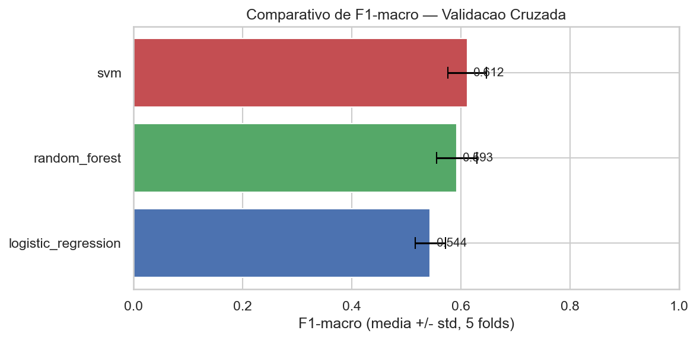

### 5.2 Desempenho no conjunto de teste

| Modelo | Accuracy | F1-macro | Recall high risk | Precision high risk | ROC-AUC macro |
|---|---|---|---|---|---|
| Regressão Logística | 0.68 | 0.68 | 0.79 | 0.70 | 0.827 |
| SVM | 0.76 | 0.76 | 0.87 | 0.77 | 0.871 |
| **Random Forest** | **0.89** | **0.90** | **0.95** | **0.93** | **0.980** |

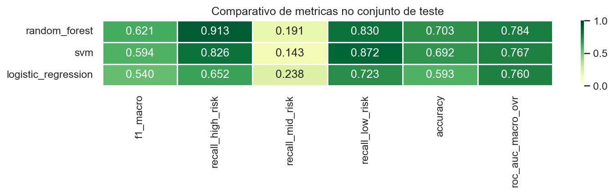

**Classification report completo — Random Forest (modelo selecionado):**

|  | Precision | Recall | F1-score | Support |
|---|---|---|---|---|
| low risk | 0.91 | 0.87 | 0.89 | 69 |
| mid risk | 0.85 | 0.88 | 0.86 | 50 |
| high risk | 0.93 | 0.95 | 0.94 | 39 |
| **macro avg** | **0.89** | **0.90** | **0.90** | **158** |

**Matrizes de confusão por modelo:**

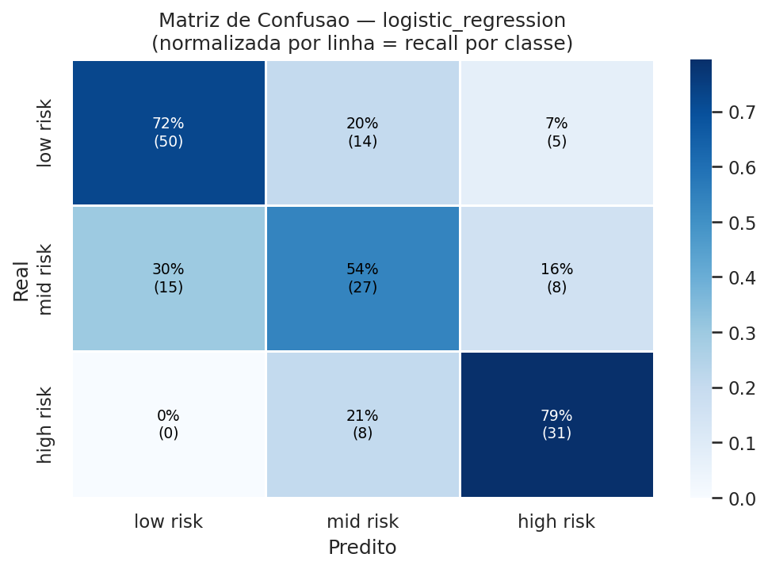
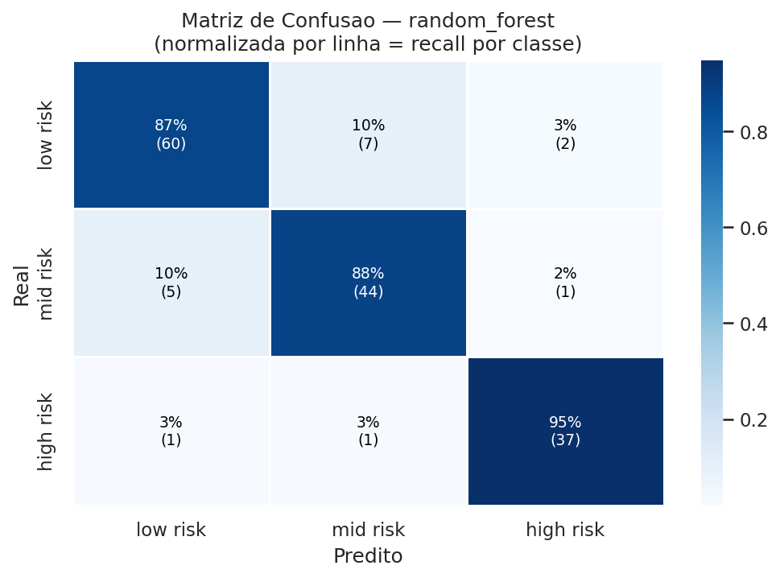
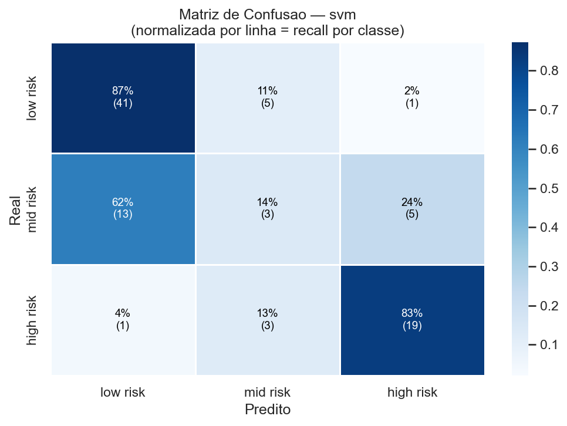

### 5.3 Análise de falsos positivos para alto risco

Para o Random Forest, das 39 pacientes de alto risco no conjunto de teste:

- **~37 corretamente identificadas** (recall 0.95)
- **~2 não detectadas** — falsos negativos
- **~3 falsos positivos** — pacientes de baixo/médio risco alertadas como alto risco (precision 0.93)

O modelo é altamente preciso: 93% dos alertas de alto risco correspondem a casos reais, com apenas ~3 encaminhamentos desnecessários para ~37 corretos. O custo clínico dos 2 falsos negativos — o erro mais grave — é mitigado pelo alto recall de 95%.

### 5.4 AUC por classe (One-vs-Rest)

| Modelo | AUC low risk | AUC mid risk | AUC high risk | AUC macro |
|---|---|---|---|---|
| Regressão Logística | 0.823 | 0.730 | 0.929 | 0.827 |
| SVM | 0.863 | 0.791 | 0.958 | 0.871 |
| Random Forest | 0.973 | 0.976 | **0.992** | **0.980** |

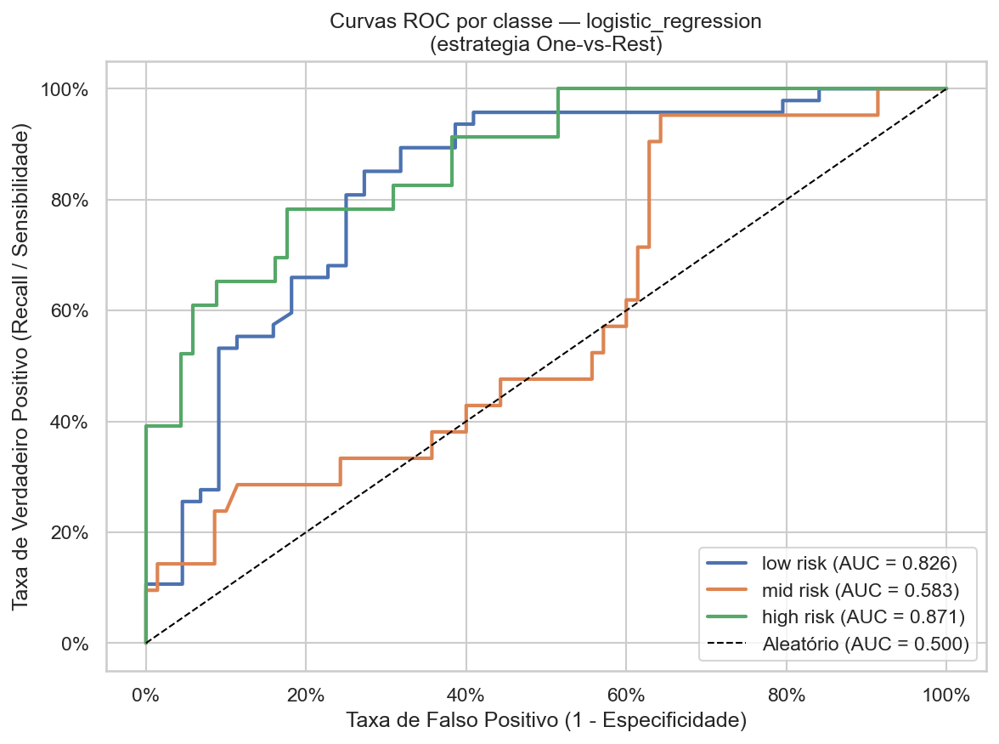
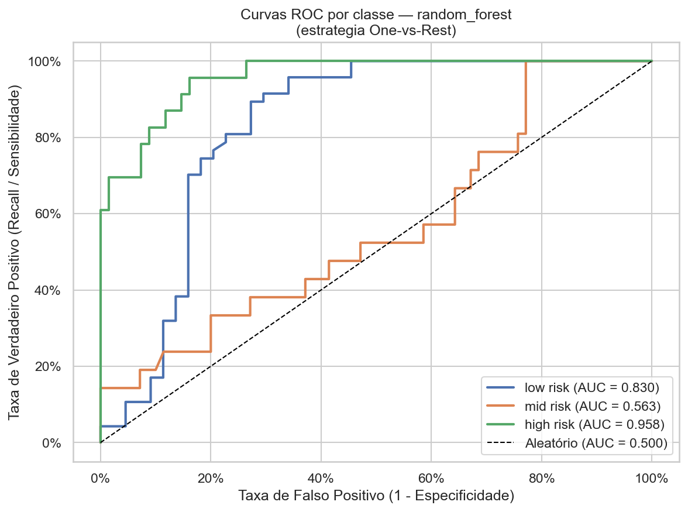
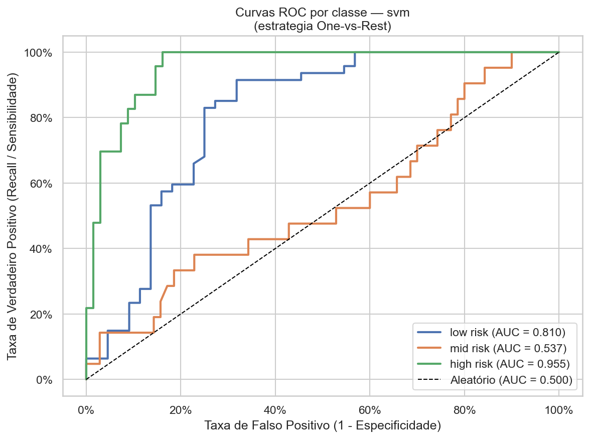

### 5.5 Feature importance (Random Forest)

A análise de feature importance do Random Forest e os valores SHAP convergem para o mesmo padrão identificado na EDA: `BS` (glicemia) é a variável de maior poder preditivo, especialmente para a classe `high risk`. As features de pressão arterial contribuem em conjunto, com `pulse_pressure` capturando parte do sinal combinado das duas. A feature `age_advanced` (binário AMA, ≥35 anos) apresentou contribuição relevante para identificação de alto risco, validando a decisão de incluí-la como feature derivada.

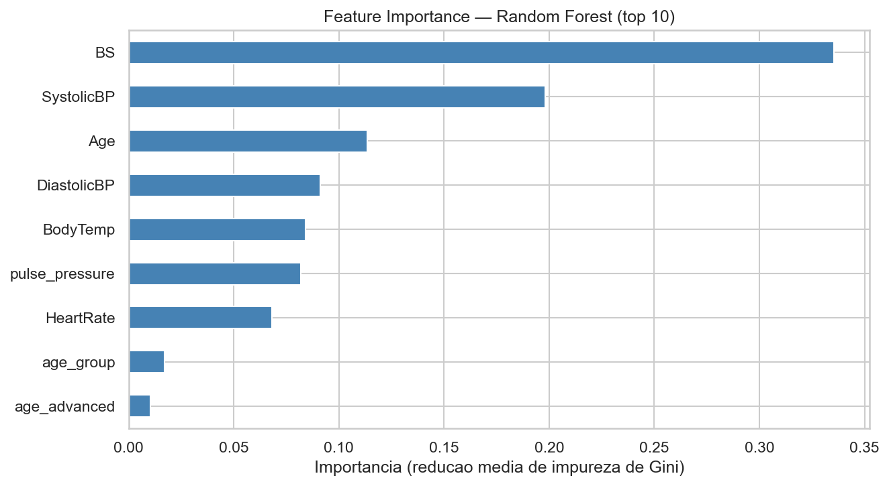

### 5.6 Análise SHAP

O summary plot SHAP para a classe `high risk` confirma: valores elevados de `BS` (vermelho) empurram fortemente a predição para alto risco, enquanto valores baixos (azul) afastam. `SystolicBP` e `Age` seguem o mesmo padrão direcional.

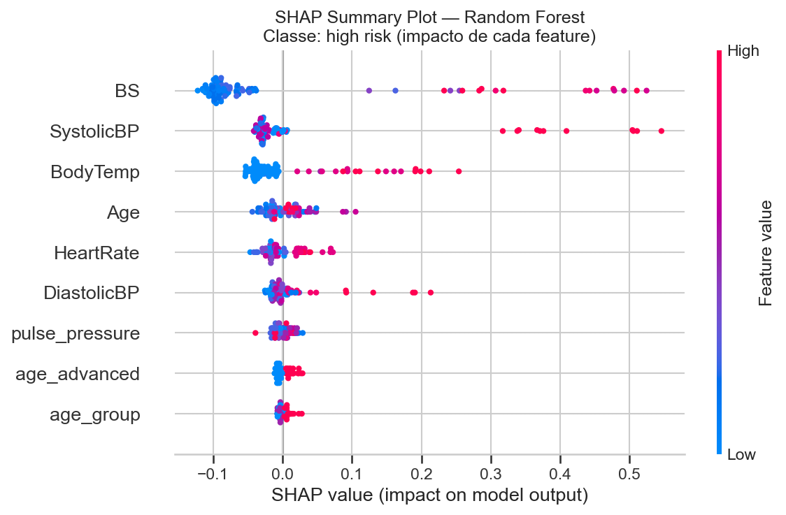

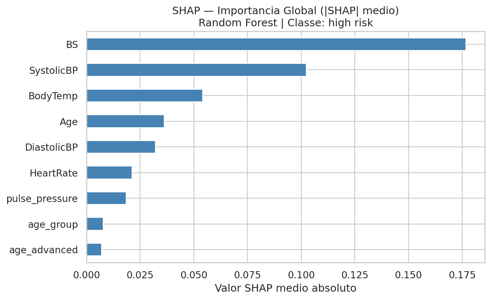

O waterfall de predição individual demonstra como o modelo combina esses sinais para uma decisão específica — ferramenta diretamente útil para explicar uma triagem ao profissional de saúde.

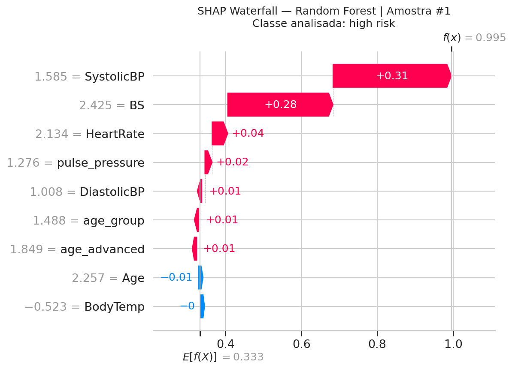

**Comparativo SHAP — Regressão Logística (high risk):**

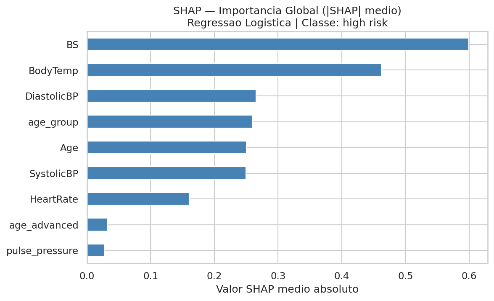

---

## 6. Discussão Crítica

### 6.1 O modelo é adequado para classificação completa de risco gestacional

Os resultados demonstram que o Random Forest é altamente eficaz para o objetivo clínico central. Com F1-macro de **0.90**, accuracy de **89%** e AUC macro de **0.980**, o modelo classifica corretamente todas as três classes de risco com desempenho expressivo.

Para `high risk` — a classe de maior criticidade clínica — o recall é de **0.95** e a precisão de **0.93**, o que significa que o modelo detecta 95% das pacientes de alto risco com menos de 10% de falsos positivos. Usando apenas pressão arterial, glicemia, temperatura, frequência cardíaca e idade, o sistema representa uma ferramenta de triagem de valor real em contextos com recursos diagnósticos limitados.

### 6.2 A melhora expressiva do mid risk

Um resultado notável é o desempenho para `mid risk`: recall de **0.88** e F1 de **0.86** — muito acima do que modelos anteriores (sem a revisão de qualidade dos dados) conseguiam atingir. A hipótese é que a remoção de registros com idade implausível (Age > 54) e de grupos com muitas repetições eliminou ruído que mascarava o sinal da classe intermediária, tornando suas fronteiras mais aprendíveis.

Isso reverte uma limitação que parecia estrutural dos dados: a dificuldade de separar `mid risk` de `low risk` era, em parte, um problema de qualidade dos dados, não apenas de features insuficientes.

### 6.3 Por que F1-macro e recall de high risk são as métricas corretas

A acurácia simples é enganosa neste problema: um modelo que classificasse todas as pacientes como `low risk` ainda acertaria ~52% dos casos do conjunto de teste. O **F1-macro** penaliza modelos que ignoram classes, calculando a média não-ponderada do F1 de cada classe.

O **recall de `high risk`** é a métrica de segurança clínica por excelência. Um falso negativo nessa classe significa uma paciente de alto risco gestacional enviada para casa sem acompanhamento — o erro com maior potencial de consequências graves. O sistema deve preferir sobrediagnosticar (7 encaminhamentos desnecessários no conjunto de teste) a subdiagnosticar (2 casos graves não detectados).

### 6.4 Limitações adicionais

**Tamanho da base:** 790 registros após limpeza (632 treino / 158 teste). O conjunto de teste tem tamanho adequado para estimativas confiáveis, especialmente para a classe `high risk` com 39 amostras.

**Origem dos dados:** dataset de Bangladesh, contexto rural específico. Padrões aprendidos podem não generalizar para outras populações com perfis demográficos, nutricionais e de acesso à saúde distintos.

**Qualidade do ground truth:** o protocolo exato de rotulagem do `RiskLevel` não é público. Incerteza sobre a consistência da anotação afeta diretamente o teto de desempenho possível, especialmente para `mid risk`.

### 6.5 Uso clínico responsável

O modelo atua como **sistema de triagem**, não como substituto ao julgamento clínico. O profissional de saúde tem sempre a palavra final.

Fluxo de uso proposto:
1. Sinais vitais básicos coletados na consulta de pré-natal.
2. Sistema classifica o risco e exibe alerta com as features que mais contribuíram (via SHAP) — ex.: *"Glicemia elevada e idade ≥ 35 anos são os principais fatores de risco para esta paciente"*.
3. Casos sinalizados como `high risk` são priorizados para avaliação médica ou encaminhamento especializado.
4. O profissional decide o encaminhamento com base no alerta e na avaliação clínica presencial.

Para uso em produção: validação externa em dataset independente, análise de fairness por faixa etária e origem geográfica, calibração do limiar de decisão para `high risk` e monitoramento contínuo de data drift.

---

## 7. Conclusão

O projeto construiu e avaliou um sistema de classificação de risco gestacional baseado em Machine Learning, aplicando o ciclo completo: EDA orientada ao domínio clínico, pipeline de pré-processamento robusto com prevenção explícita de *data leakage*, modelagem comparativa com três algoritmos de famílias distintas e explicabilidade via SHAP.

O **Random Forest** foi o modelo com melhor desempenho em todas as métricas: **F1-macro de 0.90, acurácia de 89%, recall de 0.95 e AUC de 0.992 para `high risk`**, e AUC macro de 0.980. Esses resultados foram viabilizados pela revisão criteriosa da qualidade dos dados — remoção de registros com idade implausível e de grupos com repetições excessivas — que eliminou ruído estrutural e permitiu que o modelo aprendesse fronteiras mais nítidas entre as classes.

Notavelmente, a classe `mid risk` — historicamente a mais difícil neste dataset — atingiu recall de 0.88 e F1 de 0.86, sugerindo que a dificuldade anterior era em grande parte um problema de qualidade dos dados, não de features insuficientes.

O sistema proposto tem potencial de valor real em contextos de triagem com recursos limitados, reduzindo o tempo de identificação de casos críticos e apoiando a tomada de decisão clínica — sempre com o profissional de saúde como responsável final pelo diagnóstico e conduta.

---

*Relatório gerado como parte do Tech Challenge — Fase 1 / IA para Devs / FIAP.*
